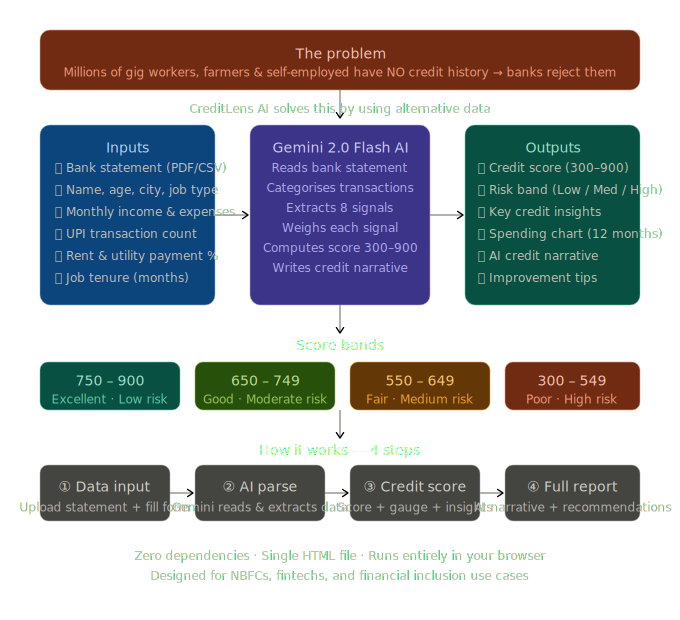

# 🏦 CreditLens AI — Alternative Credit Scoring System

> **Giving financial identity to people the system forgot.**


---

<p align="center">
  
</p>

---

## 😤 The Real Problem

**Millions of people need loans but get rejected — not because they're irresponsible, but because they're invisible to traditional credit systems.**

Banks and NBFCs use CIBIL / Experian scores which look only at previous loan repayment history, credit card usage, and number of active loans. The catch? If you've never taken a loan or credit card → you have **NO credit score** → you get **rejected automatically.**

### 👥 Who Gets Hurt?

| Person | Why They're Rejected |
|---|---|
| 🎓 Fresh graduate | No loan history yet |
| 🚗 Ola/Uber/Swiggy driver | Irregular income, no formal credit |
| 🏘️ Rural farmer | Never used a credit card |
| 👩‍💼 Homemaker | No personal income record |
| 🆕 New-to-city migrant | No local financial history |
| 🏪 Small kirana shop owner | Cash-based business, no GST |

These people are called **"Thin File"** or **"No File"** customers. There are **400–500 million** such people in India alone. They turn to loan sharks at **40–60% interest** because banks refuse to see them.

---

## ❓ The Core Question

> *"Can we predict whether a person will repay a loan — even if they have ZERO credit history — by analyzing how they live, spend, and pay their everyday bills?"*

### 💡 The Hypothesis

A person who pays their electricity bill on the 1st of every month, maintains consistent UPI transactions, has stable salary credits every 30 days, and never overdraws their account — is **very likely to repay a loan** — even if CIBIL has never heard of them.

---

## 📌 Overview

**CreditLens AI** is a browser-based alternative credit scoring tool that analyzes financial signals extracted from bank statements using **Google Gemini AI**, producing a creditworthiness score from **300–900** along with a detailed AI-generated credit narrative and improvement recommendations.

Instead of relying on a CIBIL score, CreditLens reads how people *actually live* and turns that into a credit score.

---

## 📊 What is Alternative Data?

Alternative data is any financial signal NOT from traditional banking/credit systems that still reveals a person's ability and willingness to repay.

### The 6 Categories

**1️⃣ Payment Behavior Data**
| Data Source | What It Reveals |
|---|---|
| Electricity bill | Payment discipline |
| Rent payment history | Financial responsibility |
| Mobile recharge patterns | Spending behavior |
| DTH / Cable recharge | Discretionary discipline |
| Broadband bill | Stability of residence |

**2️⃣ Bank Transaction Data**
| Signal | What You Extract |
|---|---|
| Salary credits | Is income regular? Same date every month? |
| Spending patterns | Does spending exceed income? |
| Account balance | Do they go negative often? |
| UPI transfers | Frequency and counterparties |
| Average monthly balance | Overall financial cushion |

**3️⃣ UPI & Digital Payment Data** *(India-specific and extremely powerful)*

Transaction frequency, merchant payments (grocery, medical, education = responsible spending), and recurring payments reveal a complete financial picture. 🇮🇳 India has **10 Billion+ UPI transactions per month** — this is goldmine data.

**4️⃣ Telecom / Mobile Data**

Prepaid recharge frequency, location consistency, and device type all serve as socioeconomic indicators and income proxies.

**5️⃣ Employment & Income Data**

EPF/ESIC records, ITR filings, GST data for self-employed, and gig platform data (Ola, Swiggy earnings and ratings).

**6️⃣ Psychographic / Behavioral Data**

Loan application time, form fill behavior, GPS location history (consistent home + work = stable life).

### Alternative vs Traditional Data

| Traditional Data | Alternative Data |
|---|---|
| Loan repayment history | Rent payment history |
| Credit card usage | UPI transaction patterns |
| EMI track record | Utility bill payments |
| CIBIL score | Behavioral signals |
| Available for ~200M Indians | Available for ~900M Indians |

---

## ✨ Features

- 📄 **Bank Statement Upload** — Accepts PDF, CSV, and XLS formats (up to 10 MB)
- 🤖 **Gemini AI Parser** — Extracts and categorizes transactions using Gemini 2.0 Flash
- 🎯 **Alternative Credit Score** — Scores applicants on a 300–900 scale
- 📊 **Visual Score Gauge** — Animated SVG gauge with color-coded risk bands
- 💡 **Smart Insights** — Identifies positive and negative credit indicators automatically
- 📈 **Spending Chart** — 12-month transaction breakdown visualized as a bar chart
- 📝 **AI-Generated Credit Narrative** — Professional credit report written by Gemini
- 📋 **Actionable Recommendations** — Personalized tips to improve the applicant's credit score
- 📱 **Fully Responsive** — Works across desktop and mobile devices

---

## 🏗️ How the System Works

```
User Uploads Data (Bank Statement PDF / UPI CSV / Utility Bills)
        ↓
LLM Parser — Gemini reads & extracts structured data from unstructured PDFs
        ↓
Feature Engineering — Creates financial signals (payment regularity, income stability)
        ↓
ML Scoring Model — Outputs credit score (300–900) + risk category
        ↓
Explanation Engine — LLM explains why the score is what it is, in plain English
        ↓
Dashboard — Shows score + insights + recommendations
```

### 🧮 Scoring Signals

| Signal | Weight | Description |
|---|---|---|
| Utility Bill Payment Rate | High | % of bills paid on time over 12 months |
| Rent Payment Regularity | High | % of months rent was paid on time |
| Income Stability | Medium | Monthly income level and consistency |
| Savings Rate | Medium | (Income − Expenses) / Income ratio |
| UPI Transaction Volume | Medium | Monthly digital payment activity |
| Employment Tenure | Medium | Months at current job |
| Average Monthly Balance | Low-Medium | Minimum balance maintained |
| Account Overdrafts | Negative | Overdraft events in the last 12 months |

### Score Bands

| Score Range | Category | Risk Level |
|---|---|---|
| 750 – 900 | Excellent | Low Risk |
| 650 – 749 | Good | Moderate Risk |
| 550 – 649 | Fair | Medium Risk |
| 300 – 549 | Poor | High Risk |

---

## 🌍 Impact

### On Individual Users

| Before CreditLens AI | After CreditLens AI |
|---|---|
| Rejected by banks blindly | Gets a fair, data-driven assessment |
| No idea why they were rejected | Clear explanation of their score |
| Trapped with moneylenders at 40% interest | Access to formal loans at 10–12% |
| Feels financially invisible | Has a financial identity |

**Real human impact:** A Swiggy delivery guy can get a vehicle loan to buy his own bike. A homemaker can get a small business loan to start a tiffin service. A farmer can get crop financing without going to a local middleman.

### National / Societal Impact

| Area | Impact |
|---|---|
| 📉 Poverty reduction | Cheaper credit = people can invest in themselves |
| 💼 Job creation | Small business loans → new businesses → employment |
| 🏘️ Rural development | Farmers & rural workers get formal access to capital |
| ⚖️ Financial equality | Breaks the cycle of "rich get richer" in lending |

Directly addresses **UN SDG Goal 1** (No Poverty) & **Goal 10** (Reduced Inequalities).

### The Ripple Effect

```
Your model scores 1 person fairly
        ↓
They get a loan & repay it
        ↓
Their credit history is now built
        ↓
Next time they qualify for CIBIL too
        ↓
They're permanently in the formal economy
        ↓
They employ others → cycle continues
```

### Market Numbers

| Metric | Value |
|---|---|
| Total addressable market | $1.3 Trillion (India credit gap) |
| Underserved population | 400–500 Million people |
| Fintech lending growth | 40% YoY in India |
| Alternative data market | $1.8 Billion globally by 2026 |

---

## 🚀 Getting Started

### Prerequisites

- A modern web browser (Chrome, Firefox, Edge, Safari)
- A **Google Gemini API key** — get one free at [aistudio.google.com](https://aistudio.google.com)

### Running the App

CreditLens AI is a **zero-dependency, single HTML file**. No installation required.

```bash
# Clone the repository
git clone https://github.com/hema027/credit-card-detection-.git

# Open directly in your browser
open "index (4).html"
```

### API Key Setup

1. Visit [Google AI Studio](https://aistudio.google.com/app/apikey) and generate a free Gemini API key
2. Open the app in your browser
3. Paste your key into the **Gemini API Key** field at the top
4. The badge will confirm your key status

> ⚠️ Your API key is used client-side only and is never stored or transmitted beyond Google's Gemini API.

---

## 🖥️ How to Use — 4 Steps

**① Data Input** — Upload a bank statement (PDF/CSV/XLS) + fill in personal details and financial sliders

**② Parse & Extract** — Gemini reads and categorizes the bank statement, extracts transactions and financial features

**③ Credit Score** — Animated gauge renders the score, component bars show each signal's contribution, key insights are highlighted

**④ Full Report** — Complete credit report with a unique Report ID, AI-written credit narrative, and personalized improvement recommendations

---

## 🛠️ Tech Stack

| Layer | Technology |
|---|---|
| Frontend | Vanilla HTML5, CSS3, JavaScript (ES6+) |
| AI / LLM | Google Gemini 2.0 Flash API |
| PDF Parsing | pdfplumber, LangChain document loaders |
| ML Model | XGBoost / LightGBM |
| Explainability | SHAP values |
| Dashboard | Streamlit / Plotly |
| No dependencies | No npm, no framework, no build tools |

### Core Python Libraries

```bash
pip install pandas numpy scikit-learn
pip install xgboost lightgbm
pip install pypdf2 pdfplumber
pip install langchain openai anthropic
pip install streamlit plotly
pip install shap
```

---

## 📁 Project Structure

```
credit-card-detection-/
│
├── data/
│   ├── raw/                        # Original datasets
│   ├── processed/                  # Cleaned features
│   └── sample_statements/          # Sample PDF bank statements
│
├── notebooks/
│   ├── 01_EDA.ipynb                # Explore the data
│   ├── 02_feature_engineering.ipynb
│   ├── 03_model_training.ipynb
│   └── 04_explainability.ipynb
│
├── src/
│   ├── pdf_parser.py               # LLM reads bank statement PDF
│   ├── feature_extractor.py        # Creates financial signals
│   ├── credit_model.py             # Scoring model
│   └── explainer.py                # LLM explanation generator
│
├── app/
│   └── streamlit_app.py            # Frontend dashboard
│
├── index (4).html                  # Complete browser app (no install needed)
├── creditlens_ai_overview.svg      # Architecture diagram
├── requirements.txt
└── README.md
```

---

## 📦 Datasets

| Dataset | Link | What It Has |
|---|---|---|
| Home Credit Default Risk | kaggle.com/competitions/home-credit-default-risk | 300K users, alternative data |
| Lending Club Dataset | kaggle.com/datasets/wordsforthewise/lending-club | Loan repayment + income data |
| Give Me Some Credit | kaggle.com/c/GiveMeSomeCreditFinancial | Distress prediction |
| Bank Transaction Dataset | kaggle.com | Transaction patterns |
| RBI DBIE portal | dbie.rbi.org.in | Macro credit data |

**Total build cost: ₹0** — All datasets, APIs (Groq for dev, Streamlit Cloud for hosting), and GitHub are free.

---

## ✅ Deliverable Checklist

- ✅ Working PDF bank statement parser
- ✅ Feature engineering pipeline
- ✅ Trained credit scoring model (AUC > 0.75)
- ✅ SHAP-based explainability
- ✅ LLM-generated credit report
- ✅ Streamlit dashboard
- ✅ GitHub repo with clean README
- ✅ Architecture diagram

---

## 🌐 Use Cases & Target Companies

**Who uses this:** NBFCs, microfinance institutions, fintech startups, rural/gig economy lenders, financial inclusion researchers.

**Relevant companies:** Slice, KreditBee, EarlySalary, Perfios, CreditMantri, Razorpay, CRED — all Indian fintechs working on exactly this pipeline.

---

## ⚠️ Disclaimer

CreditLens AI is a **demonstration and research tool**. Scores and narratives generated are not official credit assessments and should not be used as the sole basis for lending decisions. Always comply with applicable financial regulations in your jurisdiction.

---

## 📄 License

This project is licensed under the **MIT License**.

---

## 🙌 Contributing

Pull requests are welcome! For major changes, please open an issue first.

1. Fork the repository
2. Create your feature branch (`git checkout -b feature/your-feature`)
3. Commit your changes (`git commit -m 'Add your feature'`)
4. Push to the branch (`git push origin feature/your-feature`)
5. Open a Pull Request

---

<p align="center">Built with ❤️ for financial inclusion — Chennai, Tamil Nadu 🇮🇳</p>
